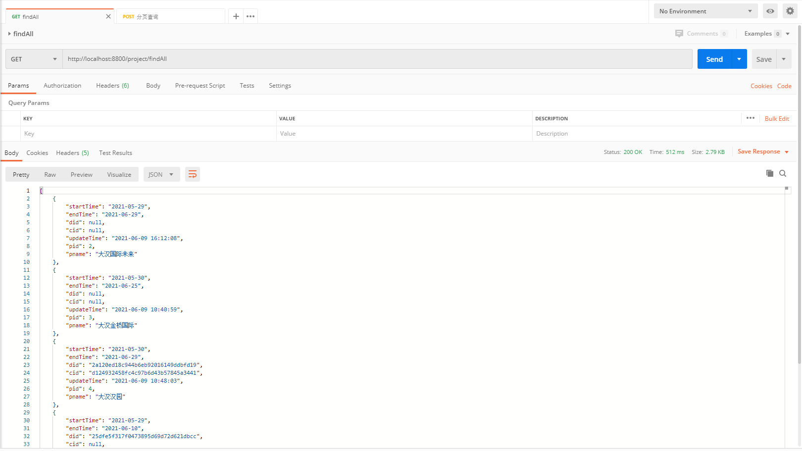
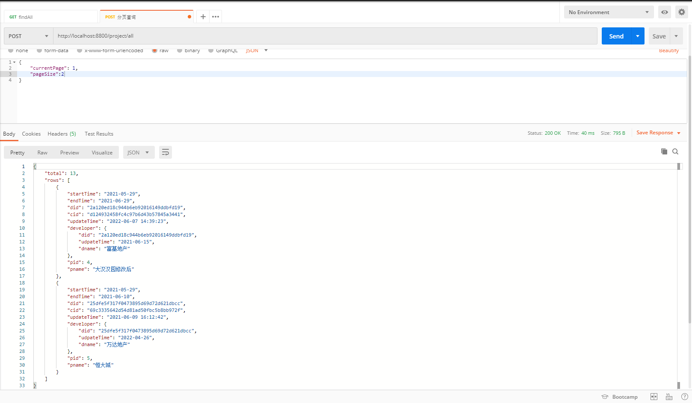

# 1-工程管理模块

## 1、查询所有工程

### 基本信息

| url        | /project/findAll |
| ---------- | ---------------- |
| **method** | **GET**          |

### 请求参数

无

### 响应结果

# 

## 2、工程列表查询翻页

### 基本信息

| url        | /project/all |
| ---------- | ------------ |
| **method** | **POST**     |

### 请求参数

| 头信息       | 值               |
| ------------ | ---------------- |
| Content-Type | application/json |

**参数信息**

| currentPage | 1    |
| ----------- | ---- |
| pageSize    | 10   |


### 响应结果

```
{
    "rows":[list集合]
     "total":12
}
```


# 

## 3、工程列表新增

### 基本信息

| url        | /project/add |
| ---------- | ------------ |
| **method** | **POST**     |

### 请求参数

| 头信息       | 值               |
| ------------ | ---------------- |
| Content-Type | application/json |

**参数信息**

表单：dataAddForm

| 表单参数  | 数据     | 描述     |
| --------- | -------- | -------- |
| pnam      | 用户输入 | 项目名称 |
| starttime | 用户输入 | 开始时间 |
| endtime   | 用户输入 | 结束时间 |

### 响应结果

```
成功{
     "flag": true,
    "message": "新建成功",
    "data": 1
}
失败{ 
    "flag": false,
    "message": "失败",
   }
```


