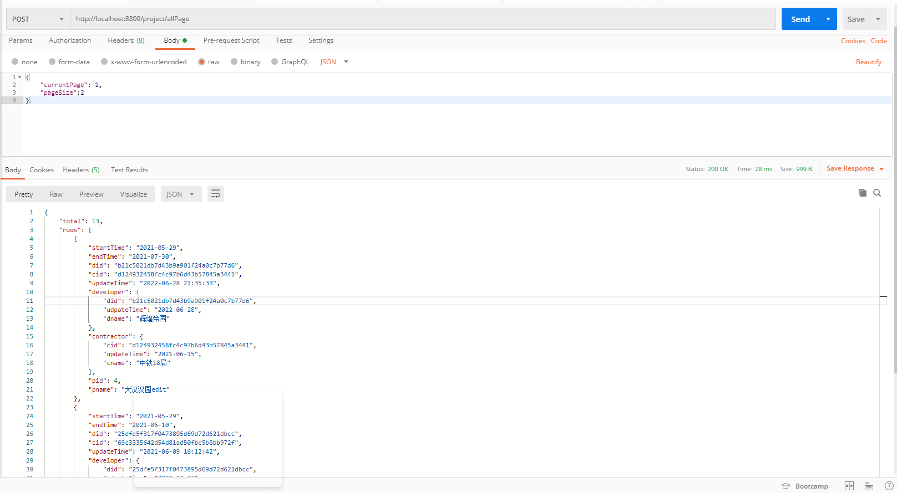
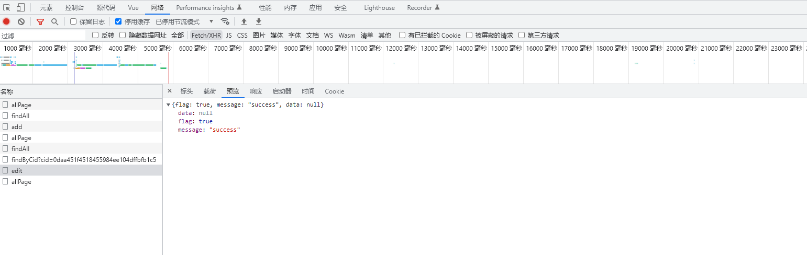

# 1-工程管理模块

## 1、查询所有工程

### 基本信息

| url        | /project/findAll |
| ---------- | ---------------- |
| **method** | **GET**          |

### 请求参数

无

### 响应结果

# 

## 2、工程列表查询翻页

### 基本信息

| url        | /project/allPage |
| ---------- | ---------------- |
| **method** | **POST**         |

### 请求参数

Headers

| key               | value                         |
| ----------------- | ----------------------------- |
| Content-Type      | application/json              |
| Transfer-Encoding | chunked                       |
| Date              | Tue, 28 Jun 2022 14:57:50 GMT |
| Keep-Alive        | timeout=60                    |
| Connection        | keep-alive                    |

**参数信息**

| currentPage | 1    |
| ----------- | ---- |
| pageSize    | 2    |


### 响应结果

```json
{
    "total": 13,
    "rows": [
        {
            "startTime": "2021-05-29",
            "endTime": "2021-07-30",
            "did": "b21c5021db7d43b9a901f24a0c7b77d6",
            "cid": "d124932458fc4c97b6d43b57845a3441",
            "updateTime": "2022-06-28 21:35:33",
            "developer": {
                "did": "b21c5021db7d43b9a901f24a0c7b77d6",
                "udpateTime": "2022-06-28",
                "dname": "辉煌帝国"
            },
            "contractor": {
                "cid": "d124932458fc4c97b6d43b57845a3441",
                "updateTime": "2021-06-15",
                "cname": "中铁18局"
            },
            "pid": 4,
            "pname": "大汉汉园edit"
        },
        {
            "startTime": "2021-05-29",
            "endTime": "2021-06-10",
            "did": "25dfe5f317f0473895d69d72d621dbcc",
            "cid": "69c3335642d54d81ad50fbc5b8bb972f",
            "updateTime": "2021-06-09 16:12:42",
            "developer": {
                "did": "25dfe5f317f0473895d69d72d621dbcc",
                "udpateTime": "2022-04-26",
                "dname": "万达地产"
            },
            "contractor": {
                "cid": "69c3335642d54d81ad50fbc5b8bb972f",
                "updateTime": "2022-06-08",
                "cname": "中铁五局"
            },
            "pid": 5,
            "pname": "恒大城"
        }
    ]
}
```




## 3、工程添加

### 基本信息

| url        | /project/add |
| ---------- | ------------ |
| **method** | **POST**     |

### 请求参数

| key          | vallue           |
| ------------ | ---------------- |
| Content-Type | application/json |

**参数信息**

表单：dataAddForm

| 表单参数  | 数据     | 描述     |
| --------- | -------- | -------- |
| pname     | 用户输入 | 项目名称 |
| starttime | 用户输入 | 开始时间 |
| endtime   | 用户输入 | 结束时间 |

### 响应结果

```json
成功{
     "flag": true,
    "message": "success",
    "data": 1
}
失败{ 
    "flag": false,
    "message": "fal",
   }
```


## 4、工程删除

<a> </a>

### 基本信息

| url        | /project/delete |
| ---------- | --------------- |
| **method** | **GET**         |


### 请求参数

Headers

| key               | value                         |
| ----------------- | ----------------------------- |
| Content-Type      | application/json              |
| Transfer-Encoding | chunked                       |
| Date              | Wed, 29 Jun 2022 00:59:50 GMT |
| Keep-Alive        | timeout=60                    |
| Connection        | keep-alive                    |

**参数信息**

| key  | value |
| ---- | ----- |
| pid  | 25    |


### 响应结果

```json
{
    "flag": true,
    "message": "success",
    "data": null
}
```


## 5、工程修改

### 基本信息

| url        | /project/edit |
| ---------- | ------------- |
| **method** | **POST**      |

### 请求参数

Headers

| key               | value                         |
| ----------------- | ----------------------------- |
| Content-Type      | application/json              |
| Transfer-Encoding | chunked                       |
| Date              | Wed, 29 Jun 2022 00:59:50 GMT |
| Keep-Alive        | timeout=60                    |
| Connection        | keep-alive                    |

**参数信息**


```json
 {
    "startTime": "2021-06-29",
    "endTime": "2021-12-30",
    "updateTime": "2022-06-28 21:35:33",
    "pname": "大汉汉园edit-plus",
    "pid": 4
}
```

### 响应结果

```json
{
    "flag": true,
    "message": "success",
    "data": null
}
```


## 6、工程项目查询

### 基本信息

| url        | /project/findByPid |
| ---------- | ------------------ |
| **method** | **POST**           |

### 请求参数

Headers

| key               | value            |
| ----------------- | ---------------- |
| Content-Type      | application/json |
| Transfer-Encoding | chunked          |

**参数信息**

| key  | value |
| ---- | ----- |
| pid  | 4     |


### 响应结果

```json
{
    "flag": true,
    "message": "success",
    "data": {
        "startTime": "2021-06-28",
        "endTime": "2021-12-30",
        "did": "12220f696f5247e6ba93275359ce4e1d",
        "cid": "d124932458fc4c97b6d43b57845a3441",
        "updateTime": "2022-06-29 18:15:21",
        "developer": null,
        "contractor": null,
        "pname": "大汉汉园edit-plus",
        "pid": 4
    }
}
```


# 2-开发商管理模块


## 1、工程列表查询翻页

### 基本信息

| url        | /developer/allPage |
| ---------- | ------------------ |
| **method** | **POST**           |

### 请求参数

Headers

| key               | value            |
| ----------------- | ---------------- |
| Content-Type      | application/json |
| Transfer-Encoding | chunked          |

**参数信息**

| currentPage | 1    |
| ----------- | ---- |
| pageSize    | 2    |


### 响应结果

```json
{
    "total": 9,
    "rows": [
        {
            "did": "12220f696f5247e6ba93275359ce4e1d",
            "updateTime": "2022-06-29",
            "dname": "绿地集团"
        },
        {
            "did": "25dfe5f317f0473895d69d72d621dbcc",
            "updateTime": "2022-04-26",
            "dname": "万达地产"
        }
    ]
}
```


## 2、工程添加

### 基本信息

| url        | /developer/add |
| ---------- | -------------- |
| **method** | **POST**       |

### 请求参数

| key          | vallue           |
| ------------ | ---------------- |
| Content-Type | application/json |

**参数信息**

表单：dataAddForm

| 表单参数 | 数据     | 描述       |
| -------- | -------- | ---------- |
| dname    | 用户输入 | 开发商名称 |

### 响应结果

```json
成功
{
     "flag": true,
    "message": "success",
    "data": 1
}
失败
{ 
    "flag": false,
    "message": "fal",
   }
```


## 3、工程删除

<a> </a>

### 基本信息

| url        | /developer/delete |
| ---------- | ----------------- |
| **method** | **GET**           |


### 请求参数

Headers

| key               | value            |
| ----------------- | ---------------- |
| Content-Type      | application/json |
| Transfer-Encoding | chunked          |

**参数信息**

| key  | value                            |
| ---- | -------------------------------- |
| did  | 53da962d3bbd46e8b9edc4d65915844e |


### 响应结果

```json
{
    "flag": true,
    "message": "success",
    "data": null
}
```


## 4、工程修改

### 基本信息

| url        | /developer/edit |
| ---------- | --------------- |
| **method** | **POST**        |


### 请求参数

Headers

| key               | value            |
| ----------------- | ---------------- |
| Content-Type      | application/json |
| Transfer-Encoding | chunked          |

**参数信息**


```json
{
    "did": "b21c5021db7d43b9a901f24a0c7b77d6", 
    "updateTime": "2022-06-29", 
    "pids": [7, 22, 23], 
    "dname": "辉煌帝国"
}
```

### 响应结果

```json
{
    "flag": true,
    "message": "success",
    "data": null
}
```


## 5、工程项目查询

### 基本信息

| url        | /developer/findByPid |
| ---------- | -------------------- |
| **method** | **POST**             |

### 请求参数

Headers

| key               | value            |
| ----------------- | ---------------- |
| Content-Type      | application/json |
| Transfer-Encoding | chunked          |

**参数信息**

| key  | value                            |
| ---- | -------------------------------- |
| did  | b21c5021db7d43b9a901f24a0c7b77d6 |


### 响应结果

```json
{
    "flag": true,
    "message": "success",
    "data": {
        "did": "12220f696f5247e6ba93275359ce4e1d",
        "updateTime": "2022-06-29",
        "pids": [
            4,
            6,
            8,
            9,
            12
        ],
        "dname": "绿地集团"
    }
}
```


# 3-承建商管理模块


## 1、工程列表查询翻页

### 基本信息

| url        | /contract/allPage |
| ---------- | ----------------- |
| **method** | **POST**          |

### 请求参数

Headers

| key               | value            |
| ----------------- | ---------------- |
| Content-Type      | application/json |
| Transfer-Encoding | chunked          |

**参数信息**

| currentPage | 1    |
| ----------- | ---- |
| pageSize    | 2    |


### 响应结果

```json
{
    "total": 7,
    "rows": [
        {
            "cid": "19a5ed7c860545a1ae9b23b67a105ffe",
            "updateTime": "2022-04-26",
            "cname": "中铁三局"
        },
        {
            "cid": "69c3335642d54d81ad50fbc5b8bb972f",
            "updateTime": "2022-06-29",
            "cname": "中铁五局666"
        }
    ]
}
```


## 2、工程添加

### 基本信息

| url        | /contract/add |
| ---------- | ------------- |
| **method** | **POST**      |

### 请求参数

| key          | vallue           |
| ------------ | ---------------- |
| Content-Type | application/json |

**参数信息**

表单：dataAddForm

| 表单参数 | 数据     | 描述       |
| -------- | -------- | ---------- |
| cname    | 用户输入 | 承建商名称 |
| pids     | 用户输入 | 工程项目id |

### 响应结果

```json
成功
{
     "flag": true,
    "message": "success",
    "data": 1
}
失败
{ 
    "flag": false,
    "message": "fal",
   }
```


## 3、工程删除

<a> </a>

### 基本信息

| url        | /contract/delete |
| ---------- | ---------------- |
| **method** | **GET**          |


### 请求参数

Headers

| key               | value            |
| ----------------- | ---------------- |
| Content-Type      | application/json |
| Transfer-Encoding | chunked          |

**参数信息**

| key  | value                            |
| ---- | -------------------------------- |
| did  | 0b613fe02ce44a4a9c1f86a0c996fcb5 |


### 响应结果

```json
{
    "flag": true,
    "message": "success",
    "data": null
}
```


## 4、工程修改

### 基本信息

| url        | /developer/edit |
| ---------- | --------------- |
| **method** | **POST**        |


### 请求参数

Headers

| key               | value            |
| ----------------- | ---------------- |
| Content-Type      | application/json |
| Transfer-Encoding | chunked          |

**参数信息**


```json
{
    "cid": "0daa451f4518455984ee104dffbfb1c5", 
    "updateTime": "2022-06-29", 
    "pids": [12], 
    "cname": "啊啊"
}
```

### 响应结果

```json
{
    "flag": true,
    "message": "success",
    "data": null
}
```



## 5、工程项目查询

### 基本信息

| url        | /contract/findByPid |
| ---------- | ------------------- |
| **method** | **POST**            |

### 请求参数

Headers

| key               | value            |
| ----------------- | ---------------- |
| Content-Type      | application/json |
| Transfer-Encoding | chunked          |

**参数信息**

| key  | value                            |
| ---- | -------------------------------- |
| did  | 69c3335642d54d81ad50fbc5b8bb972f |


### 响应结果

```json
{
    "flag": true,
    "message": "success",
    "data": {
        "cid": "69c3335642d54d81ad50fbc5b8bb972f",
        "updateTime": "2022-06-29",
        "pids": [
            5,
            7,
            9,
            15
        ],
        "cname": "中铁五局666"
    }
}
```


